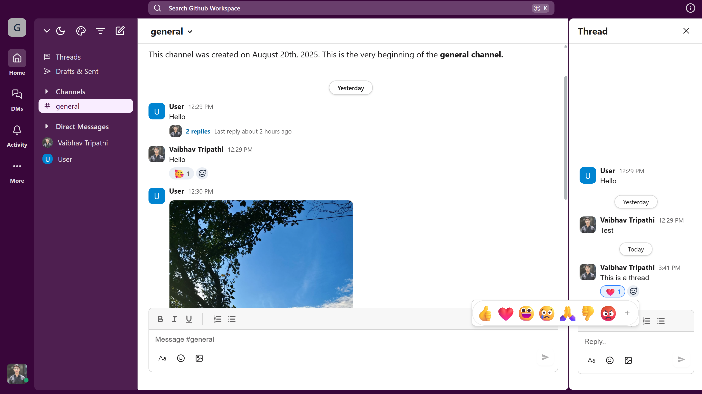

# Slack X

A real-time team chat app built with Next.js 15 and Convex. Think Slack, but modern and lightweight.

## Demo



## What it does

- **Real-time messaging** in channels and DMs
- **Threads** for organized conversations
- **Emoji reactions** on messages
- **File sharing** (images)
- **Workspace management** with member roles
- **Global search** across everything
- **Theme switching** (light/dark + color palettes)
- **Multi-auth** (Google, GitHub, email/password)

## Tech Stack

- **Frontend**: Next.js 15, TypeScript, Tailwind CSS
- **Backend**: Convex (real-time DB + auth)
- **Icons**: Lucide React
- **State**: Jotai
- **Deploy**: Vercel

## Getting Started

### Prerequisites

- Node.js 18+
- npm/yarn/pnpm/bun
- Convex account (free tier available)

### Quick Start

```bash
# Clone and install
git clone https://github.com/vaibhavxtripathi/Slack-X.git
cd Slack-X
npm install

# Set up Convex backend
npx convex dev
# Follow prompts to create project and get deployment URL

# Add to .env.local
echo "NEXT_PUBLIC_CONVEX_URL=your_convex_deployment_url" > .env.local

# Run dev server
npm run dev
```

Open [http://localhost:3000](http://localhost:3000) to see it in action.

## Usage

- **Workspaces**: Create one, invite people with join codes
- **Channels**: Organize conversations by topic
- **Messages**: Rich text, emoji reactions, threads
- **Search**: `Ctrl/Cmd+K` to search everything
- **Themes**: Switch between light/dark + color palettes

## Deployment

### Vercel (Recommended)

1. Push to GitHub
2. Connect to Vercel
3. Add `NEXT_PUBLIC_CONVEX_URL` env var
4. Deploy

### Manual

```bash
npm run build
# Deploy the out/ folder
```

## Contributing

PRs welcome!

1. Fork the repo
2. Create a feature branch
3. Make your changes
4. Submit a PR

## License

MIT

## Built with

- [Next.js](https://nextjs.org/)
- [Convex](https://convex.dev/)
- [Lucide](https://lucide.dev/)

---

**Built by [Vaibhav Tripathi](https://github.com/vaibhavxtripathi)**
